# HCT 웹 디자인 템플릿

대시보드 · 분석도구 · 관리도구를 만들 때 쓰는 디자인 시스템입니다.
여러 개발 에이전트가 각자 만든 화면이 **하나의 제품처럼 보이게** 하는 것이 목적입니다.

> **에이전트라면 [AGENTS.md](./AGENTS.md) 를 먼저 읽으세요.** 이 README 는 사람용 개요입니다.

---

## 벤치마킹한 것 — 레이아웃이 아니라 구조

노션·지라·슬랙의 공통점은 "사이드바가 있다"가 아닙니다.
셋 다 **하나의 원자(atom)와 그 위의 여러 투영(projection)** 구조입니다.

| | 원자 | 투영 |
|---|---|---|
| 노션 | 페이지/블록 | 표 · 보드 · 갤러리 · 캘린더 |
| 지라 | 이슈 | 백로그 · 보드 · 목록 · 대시보드 |
| 슬랙 | 메시지 | 채널 · 스레드 · 저장됨 · 멘션 |

그래서 이 시스템의 중심은 컴포넌트가 아니라 **필드 스키마**입니다.
스키마 하나를 정의하면 표·보드·상세·필터·질의·대시보드가 전부 거기서 나옵니다.

```
필드 스키마 (src/lib/fields.js)
   ├─ DataGrid      표 뷰 + 인라인 편집 + 그룹핑
   ├─ BoardView     보드 뷰 + 드래그로 상태 전환
   ├─ ObjectDetail  상세 + 활동 기록
   ├─ QueryBar      필터 빌더 + 질의문
   └─ MetricTile    지표 = 질의 + 집계 → 클릭하면 목록으로
```

**시각 방향은 지라형 고밀도**입니다. 본문 14px, 행 32~40px, 명확한 구분선,
상태별 색상 코드.

---

## 이 시스템이 실제로 하는 것

### 1. 같은 데이터, 여러 뷰

표에서 보던 레코드를 보드로 전환하면 같은 레코드가 컬럼으로 재배치됩니다.
카드를 끌어 옮기면 상태가 바뀌고, 표로 돌아가면 반영되어 있습니다.


### 2. 저장된 뷰가 곧 내비게이션

사이드바의 "내 뷰"는 개발자가 하드코딩한 메뉴가 아니라 사용자가 저장한 질의입니다.
필터를 바꾸면 탭에 점이 뜨고, 저장하거나 되돌릴 수 있습니다.

### 3. 필터는 다룰 수 있는 객체

조건을 쌓고, 결합 방식(AND/OR)을 고르고, 질의문으로 읽고, 뷰로 저장합니다.


### 4. 목록에서 바로 끝냅니다

셀을 클릭하면 그 자리에서 편집됩니다. 상세 페이지로 갈 필요가 없습니다.
Shift 로 범위 선택하고 벌크 액션을 실행합니다. 행 액션은 호버 시에만 나타납니다.


### 5. 상세는 살아있는 객체

읽기 전용 속성 나열이 아니라, 인라인 편집 + 상태 전환 + 변경 이력과 댓글이
한 줄기로 흐르는 활동 피드입니다.


### 6. 대시보드는 작업의 입구

모든 지표가 **질의 + 집계**입니다. 숫자가 어떤 레코드에서 나왔는지 알고 있어서,
클릭하면 그 조건으로 필터된 목록에 그대로 들어갑니다.

| 대시보드 | 지표 클릭 → 드릴다운 |
|---|---|
|  |  |

임계값을 넘긴 지표는 스스로 알리고, 증감은 **비교 대상 값을 함께** 밝힙니다.
분해(breakdown)는 지표와 같은 집계를 써서 합계와 조각이 일치합니다.

라이트/다크는 시맨틱 토큰이 모두 처리합니다.


---

## 통일성이 강제되는 방식

문서에 "규칙을 지켜주세요"라고 적으면 지켜지지 않습니다. 세 층으로 만들었습니다.

**1층 — 토큰이 선택지를 없앰**
`tailwind.config.js` 에서 Tailwind 기본 색상 팔레트를 **삭제했습니다.**
`bg-blue-500` 은 존재하지 않는 클래스라 아무 효과가 없습니다.
간격도 4px 배수로 제한됩니다.

**2층 — 컴포넌트가 결정을 대신함**
`<StatusBadge status="inProgress" />` 는 색을 고를 권한을 주지 않습니다.
필드 스키마의 `status` 키가 색을 결정하므로, "진행중"은 표에서든 보드에서든
상세에서든 대시보드에서든 같은 파란색입니다.

**3층 — 검사가 위반을 잡음**
```bash
npm run lint:design
```
생색 하드코딩, `dark:` 직접 사용, 스케일 밖 간격, 포커스 표시 제거,
`<table>` 직접 작성 등 11개 규칙. 위반 시 종료 코드 1.

---

## 빠른 시작

```bash
npm install
npm run dev          # 미리보기 — 대시보드 지표를 클릭해 드릴다운을 확인하세요
npm run lint:design
```

새 화면은 `src/pages/ListPage.jsx` 를 복사해서 시작하세요. 백지에서 시작하지 마세요.

링크 하나로 모든 화면을 공유하려면 HTML 파일 하나로 묶습니다:

```bash
node scripts/build-standalone.mjs        # dist-standalone/hct-console.html
```

---

## 다른 프로젝트에서 쓰기

이 저장소는 **설치해서 쓰는 패키지**입니다. 화면을 만드는 사람이 사람이든
에이전트든, 아래 세 줄을 거치면 색·간격·컴포넌트가 자동으로 이 시스템 안에
들어옵니다.

### 1. 설치

```bash
npm i github:dytc880915-commits/hct-web-design-template
npm i -D "tailwindcss@^3.4" postcss autoprefixer
```

> **Tailwind 는 3.x 여야 합니다.** v4 는 설정 방식이 완전히 달라 이 프리셋이
> 동작하지 않습니다. `npm i -D tailwindcss` 만 치면 v4 가 깔립니다.

### 2. tailwind.config.js

```js
import hct, { hctContent } from 'hct-web-design-template/tailwind-preset'

export default {
  presets: [hct],
  content: [...hctContent, './index.html', './src/**/*.{js,jsx,ts,tsx}'],
}
```

`hctContent` 를 빼먹지 마세요. **Tailwind 는 프리셋의 `content` 를 병합하지
않습니다** — 앱의 `content` 가 프리셋 것을 통째로 덮어씁니다. 그러면
`node_modules` 안의 컴포넌트가 스캔되지 않아 클래스가 전부 purge 되고,
**오류 없이** 스타일만 빠진 화면이 나옵니다.

빼먹으면 개발 중 콘솔에 무엇을 고쳐야 하는지 적힌 오류가 뜹니다
(`AppShell` 이 마운트될 때 실제로 측정해서 확인합니다).

### 3. 앱의 CSS

```css
@import 'hct-web-design-template/styles/hct.css';

@tailwind base;
@tailwind components;
@tailwind utilities;
```

`@tailwind` 지시어는 패키지가 넣지 않습니다. 앱마다 Tailwind 설정이 다르고,
남의 패키지가 그걸 대신 정하면 안 됩니다.

### 그리고 화면

팔레트나 테마 설정은 **하지 않아도 됩니다.** 속성을 안 붙이면 기본 팔레트가
그대로 적용됩니다.

```jsx
import {
  PageContainer, PageHeader, DataGrid, GridCard, Button, StatusBadge,
  ToastProvider, normalizeFields,
} from 'hct-web-design-template'
import { AppFrame } from 'hct-web-design-template/pages'

const FIELDS = normalizeFields([
  { key: 'id',    label: '번호',   type: 'text', width: '96px' },
  { key: 'name',  label: '장비명', type: 'text' },
  { key: 'state', label: '상태',   type: 'select', width: '104px', options: [
    { value: 'run',  label: '가동', status: 'done' },
    { value: 'stop', label: '정지', status: 'blocked' },
  ] },
])

export function EquipmentPage() {
  return (
    <AppFrame active="list" counts={{ list: rows.length }}>
      <PageContainer>
        <PageHeader title="장비 현황" actions={<Button variant="primary">장비 추가</Button>} />
        <GridCard>
          <DataGrid fields={FIELDS} records={rows} selectable={false} primaryField="name" />
        </GridCard>
      </PageContainer>
    </AppFrame>
  )
}
```

이 40줄이 아래 화면이 됩니다 — 사이드바·상단바·검색·표·상태 뱃지·다크 모드가
전부 따라옵니다.

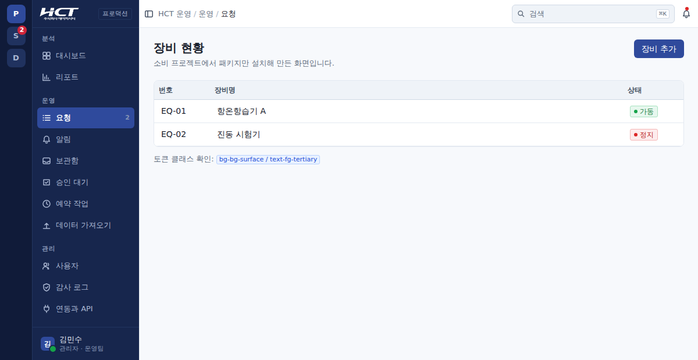

### 에이전트에게 시킬 때

작업을 맡기기 전에 이 한 줄을 붙이세요:

> 이 프로젝트는 `hct-web-design-template` 디자인 시스템을 씁니다.
> 화면을 만들기 전에 `node_modules/hct-web-design-template/AGENTS.md` 를 먼저 읽고,
> 끝나면 `npm run lint:design` 을 통과시키세요.

`AGENTS.md` 는 패키지에 함께 배포됩니다. 규칙을 외우게 하는 대신 **읽을 수 있는
자리에 두는 것**이 핵심입니다.

### 무엇이 강제되고 무엇이 안 되는가

정직하게 말하면 두 층입니다.

| | 어떻게 |
|---|---|
| **기계가 막습니다** | Tailwind 기본 팔레트가 제거되어 `bg-blue-500` 은 **CSS 가 생성되지 않습니다.** 간격도 4px 배수 밖은 무시됩니다. `lint:design` 이 13개 규칙으로 빌드를 실패시킵니다. CI 가 PR마다 돌립니다. |
| **에이전트가 협조해야 합니다** | AGENTS.md 를 읽는 것, 컴포넌트를 쓰는 것(직접 `<div>` 로 표를 짜면 lint 가 경고는 하지만 막지는 못합니다), 로딩·빈 상태·오류 상태를 함께 구현하는 것. |

두 번째 층을 좁히는 방법은 **원형을 복사하게 하는 것**입니다. 백지에서 시작하면
협조에 기대야 하지만, `ListPage.jsx` 를 복사해 고치면 구조가 이미 들어 있습니다.

---

## 저장소 구조

```
AGENTS.md                에이전트 작업 규칙 (가장 중요)
CLAUDE.md                AGENTS.md 로 연결

src/lib/
  fields.js              필드 타입 시스템 — 이 시스템의 원자
  query.js               질의 모델 (필터·정렬·그룹핑)
  queryUrl.js            질의 ↔ URL 직렬화 (링크로 공유)
  metrics.js             지표 = 질의 + 집계, 드릴다운·분해·임계값
  useRecords.js          낙관적 편집 + 롤백 + 실행 취소 + 활동 기록
  useForm.js             폼 상태·검증·dirty 추적·이탈 방지
  useGridKeyboard.js     목록 키보드 조작
  useVirtualRows.js      행 가상화
  useBottomBar.js        하단 중앙 요소 충돌 방지
  useMeasuredWidth.js    SVG 차트 반응형 폭
  csv.js                 최소 CSV 파서 (가져오기)
  importing.js           열 연결 추측 + 행 검증 — 규칙은 필드 스키마에서 나옵니다
  cn.js / theme.js

tokens/brand.json        회사 로고·워드마크 (보고서 저장소에서 옮겨옴)
tokens/tokens.json       원천 토큰
src/styles/tokens.css    CSS 변수 (라이트/다크)
tailwind.config.js       토큰 → Tailwind 매핑

src/components/
  shell/     AppShell, Sidebar, Topbar, RightPanel
  grid/      DataGrid(가상화·키보드), GridCell, ColumnSettings, GridChrome
  view/      BoardView, ViewTabs, ViewSwitcher, SavedViewList
  query/     QueryBar, FilterBuilder
  object/    ObjectDetail, StatusTransition, ActivityFeed
  chart/     LineChart, BarChart, ChartTable, chartTokens
  dashboard/ MetricTile, BreakdownList, Sparkline, Widget
  form/      Form, FormSection, FormRow, FormActions, SaveBar, Switch, RadioCards
  state/     EmptyState, NoResults, ErrorState, ErrorPage, Skeleton
  input/     Button, TextField, Combobox, SegmentedControl, Stepper, Dropzone, SecretField
  auth/      AuthLayout, PasswordStrength
  feedback/  StatusBadge, Tag, Banner, Toast, Progress, JobStatus
  overlay/   Modal, ConfirmDialog, Drawer, CommandPalette, ShortcutHelp
  index.js   ← 여기서만 import

src/pages/
  _shell.jsx             ← 내비게이션 정의 한 곳 (AppFrame). 사이드바를 직접 짜지 마세요
  _data.js               스키마와 예시 레코드
  _notifications.js      알림 타입 — 인박스와 알림 설정이 같이 봅니다

  DashboardPage.jsx      대시보드 (드릴다운·차트)
  ListPage.jsx           목록 + 뷰 + 상세
  ScalePage.jsx          대용량·비동기 작업
  InboxPage.jsx          알림 인박스
  ImportPage.jsx         가져오기 마법사
  ApprovalsPage.jsx      승인 대기
  JobsPage.jsx           예약 작업
  SearchPage.jsx         검색 결과

  AdminPage.jsx          사용자·권한
  AuditPage.jsx          감사 로그
  IntegrationsPage.jsx   연동·API 키·웹훅
  BillingPage.jsx        사용량과 청구
  SettingsPage.jsx       환경설정 (워크스페이스)
  AccountPage.jsx        내 계정 (나)

  LoginPage.jsx          로그인
  AuthPages.jsx          초대 수락·비밀번호 재설정
  OnboardingPage.jsx     빈 워크스페이스
  ErrorPages.jsx         403·404·500·점검 중

scripts/lint-design.mjs
docs/
```

---

## 브랜드

로고와 회사 정보는 **보고서 템플릿 저장소**(`hct-report-template`)의
`brand/hct/` 에서 가져왔습니다. 보고서와 화면이 같은 자산을 씁니다.

강조색은 **로고색 `#2F4A9C`** 입니다. 보고서 템플릿 README 가
*"회사 지정색을 쓰려면 `--br-cobalt` 를 바꾼다. 로고색 `#2f4a9c` 는 밝은 지면
대비 7.51:1 로 강조색 요건을 만족한다"* 라고 적어 두었기 때문입니다.

로고는 **면의 밝기에 따라 두 벌**을 씁니다. 원색은 어두운 배경에서 대비가
2:1 수준이라 보이지 않으므로, 어두운 사이드바에는 흰색 녹아웃판이 나갑니다.

```jsx
<Logo on="dark" height={22} />   {/* 어두운 사이드바 */}
<Logo on="light" height={40} />  {/* 흰 로그인 카드 */}
```

> 원본이 264×86 래스터입니다. 화면(24~40px)에는 충분하지만 인쇄·대형 확대에는
> 부족합니다. **SVG 원본이 확보되면 `Logo.jsx` 만 고치면 됩니다.**
> 보고서 템플릿 README 도 같은 지적을 하고 있습니다.

---

## 화면 원형 16종

관리도구를 만들면 결국 다 필요해지는 화면들입니다. 각 파일 맨 위 주석에
**그 화면에서 흔히 저지르는 실수와 그것을 어떻게 막았는지**가 적혀 있습니다.

### 업무 화면

| | 무엇을 보여주는가 |
|---|---|
| **대시보드** | 지표 = 질의 + 집계. 클릭하면 목록으로 드릴다운. 선·막대 차트, 임계값 |
| **목록 + 상세** | 표↔보드 전환, 인라인 편집, 저장된 뷰, 키보드 조작, 실행 취소 |
| **대용량** | 5,000건 가상화, 조건 전체 선택, 진행률과 부분 실패 |
| **알림 인박스** | 이벤트가 아니라 **객체 단위로 묶습니다.** 나를 부른 것과 구경거리를 구분 |
| **가져오기 마법사** | 올리기 → 열 연결 → **확인** → 실행. 검증이 없는 가져오기는 반드시 사고를 냅니다 |
| **승인 대기** | 바뀌는 값을 목록에서 바로 보여줍니다. 반려에는 사유 필수 |
| **예약 작업** | 배치는 조용히 실패합니다. 실패를 정렬로 숨길 수 없게 했습니다 |
| **검색 결과** | 종류별 묶음, 일치 부분 강조, 못 찾았을 때 원인 셋을 짚어줌 |

### 관리 화면

| | 무엇을 보여주는가 |
|---|---|
| **관리자** | 사용자·역할, 권한 매트릭스, 초대, 마지막 관리자 보호 |
| **감사 로그** | 고칠 수 없는 기록. 이전 값 → 이후 값, 사람인지 기계인지, 보존 기간 |
| **연동·API 키·웹훅** | 바깥과 연결되는 지점 전부. 마지막 사용 시각으로 죽은 연결을 드러냅니다 |
| **사용량과 청구** | 한도를 넘기 **전에** 알립니다. 청구 주기에서 오늘이 어디인지 함께 표시 |
| **환경설정** | 워크스페이스 전체에 영향. 폼 검증·저장 바·이탈 방지 |
| **내 계정** | 나에게만 적용. 프로필·비밀번호·접속 기기·알림 설정 |

### 셸 밖 화면

| | 무엇을 보여주는가 |
|---|---|
| **로그인** | SSO 우선, 실패 사유 구분(재시도 가능 vs 잠김), 계정 존재 여부 비노출 |
| **인증 흐름** | 초대 수락, 비밀번호 재설정 요청·설정 |
| **빈 워크스페이스** | 첫 실행. 왜 비어 있는지 말하고, 다음 할 일을 하나씩 |
| **오류 4종** | 403·404 는 셸 안, 500·점검은 셸 밖. 403 은 "누구에게 요청하는지"까지 |

### 알림 인박스 — 이벤트가 아니라 묶음

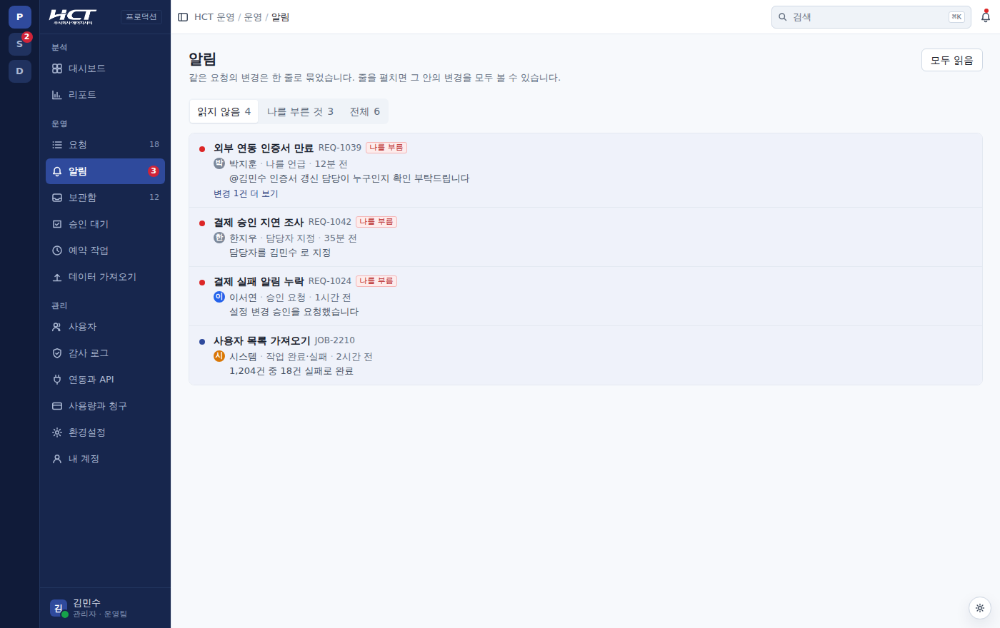

인박스가 실패하는 방식은 거의 하나입니다: **이벤트를 시간순으로 그대로
늘어놓는 것.** 바쁜 날에는 같은 요청의 변경 다섯 줄이 화면을 채우고, 정작
나를 부른 한 줄이 묻힙니다. 그래서 한 줄 = 한 객체이고, 그 안에 변경이
쌓입니다. 나를 부른 것(언급·담당 지정·승인)은 빨간 점, 구독한 항목의 변화는
굵기로만 — 전부 빨갛게 하면 아무것도 급하지 않습니다.

### 가져오기 — 실행 전에 전부 검증합니다

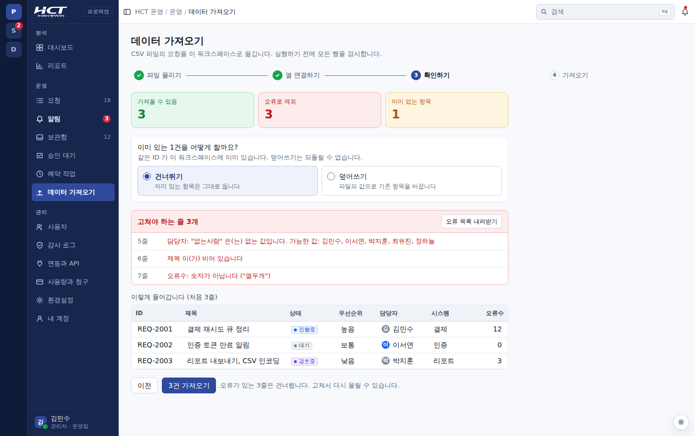

넣다가 실패하면 절반만 들어간 상태로 멈추고, 그 상태를 정리하는 일은
사용자에게 넘어갑니다. 그래서 3단계(확인)가 이 화면의 존재 이유입니다.
오류는 **CSV 파일의 줄 번호**로 말합니다 — "3번째 항목"은 파일에서 찾을 수
없습니다. 선택지가 틀렸으면 가능한 값을 함께 알려주고, 오류 행만 CSV 로
내려받아 고쳐서 다시 올릴 수 있습니다. 검증 규칙은 표·필터가 쓰는 것과
**같은 필드 스키마**에서 나옵니다.

### 승인 대기 — 누르기 쉽게 만들지 않습니다

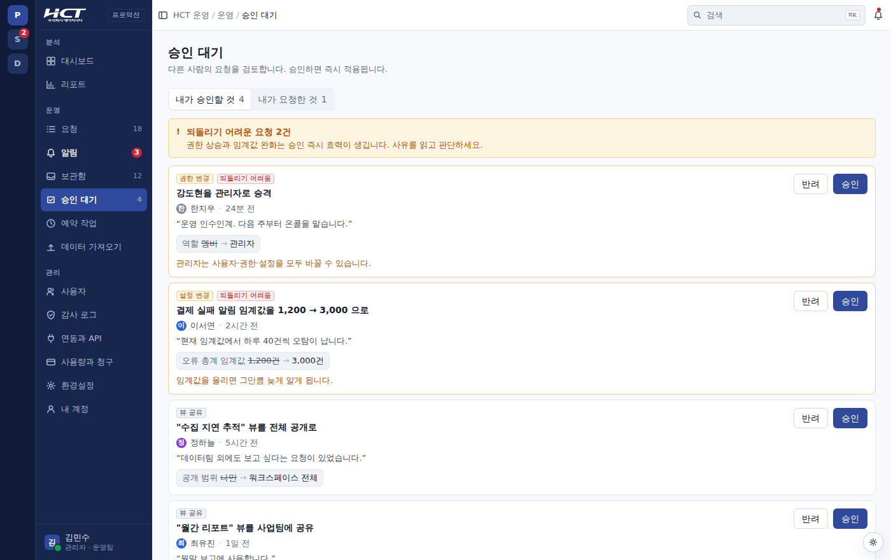

목록에 체크박스와 "선택 항목 승인"을 두면 사람들은 읽지 않고 누릅니다.
그러면 승인 절차는 형식만 남습니다. 바뀌는 값을 카드 안에 그대로 넣고,
권한 상승 같은 되돌리기 어려운 항목은 한 건씩만 처리합니다. 반려에는 사유가
필수입니다 — 이유 없이 반려당한 사람은 같은 요청을 다시 올립니다.

### 예약 작업 — 실패의 가시성

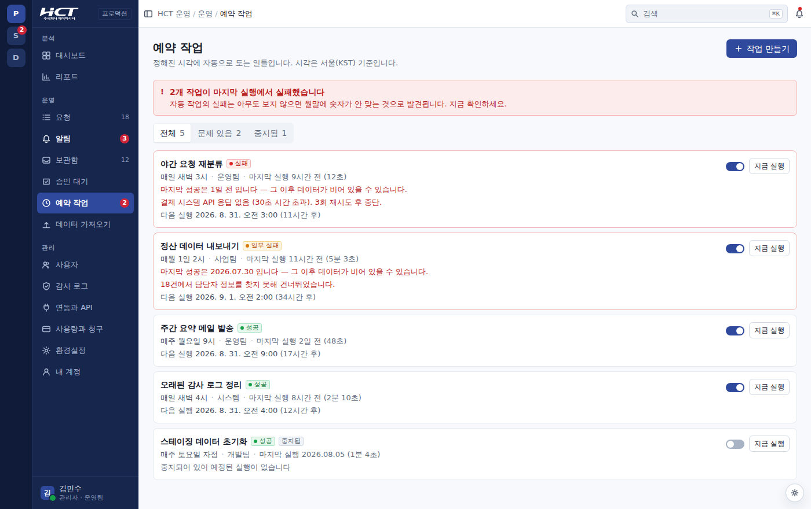

배치는 아무도 안 보는 곳에서 조용히 실패하고, 월말에 숫자가 안 맞는 것으로
발견됩니다. 실패한 작업은 항상 맨 위에 오고 정렬로 숨길 수 없습니다.
"마지막 실행"과 "마지막 성공"을 따로 보여줍니다 — 그 사이가 벌어져 있으면
그만큼 데이터가 비어 있다는 뜻입니다. 일정은 cron 이 아니라 사람 말로 씁니다.

### 감사 로그 — 고칠 수 없다는 것이 전부

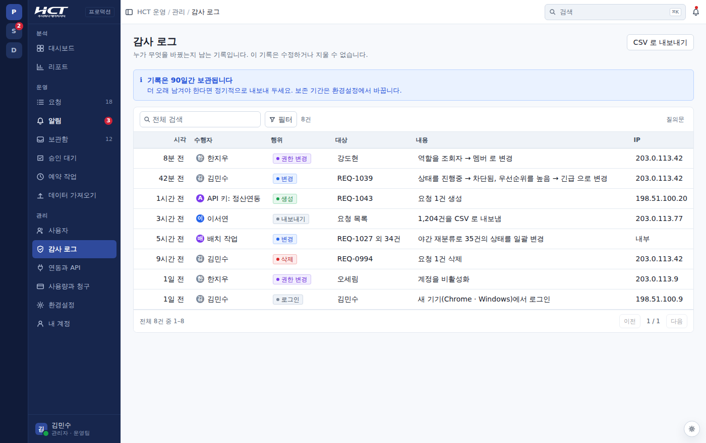

편집 가능한 감사 로그는 감사 로그가 아닙니다. 그래서 선택도 인라인 편집도
없습니다. 대신 조사에 필요한 것을 갖춥니다: 이전 값 → 이후 값, 사람이 한
일인지 API 키·배치가 한 일인지, 출처 IP, 그리고 **보존 기간**. 언제까지
남는지 말하지 않으면 사람들은 영원할 거라 믿고, 사고가 난 뒤에 없다는 걸
알게 됩니다.

### 사용량과 청구 — 넘기 전에 알립니다

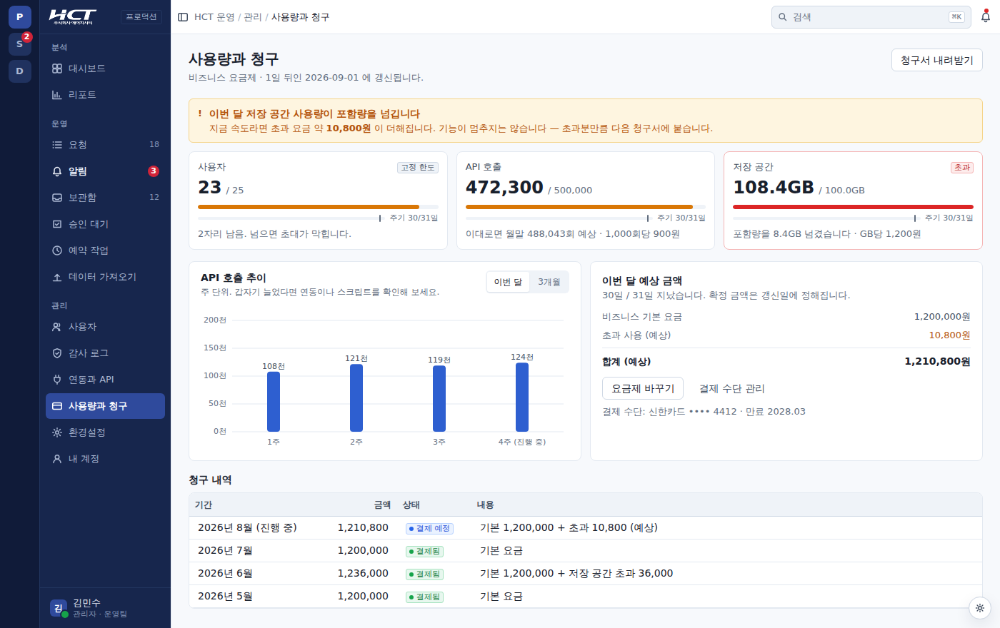

한도를 넘은 **뒤에** 알려주는 것이 이 화면의 유일한 실패 방식입니다.
그래서 막대에 청구 주기의 오늘 위치를 함께 찍습니다 — 20일에 80%를 쓴 것과
29일에 80%를 쓴 것은 전혀 다른 상황입니다. 좌석처럼 넘길 수 없는 한도와
초과 요금이 붙는 한도를 구분해 말합니다.

### API 키 — 한 번만 보여줍니다

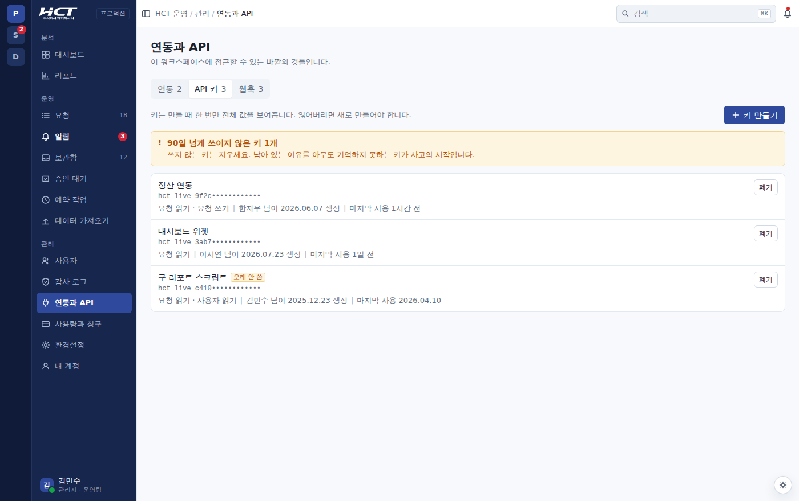

다시 볼 수 있는 키는 유출되어도 추적이 불가능합니다. 발급 직후 화면에서는
**"지금만 볼 수 있다"를 값보다 먼저** 말합니다 — 값을 먼저 보여주면 사람들은
창을 닫고 나서 읽습니다. 목록에는 마지막 사용 시각을 둡니다. 남아 있는 이유를
아무도 기억하지 못하는 키가 사고의 시작입니다.

### 빈 워크스페이스 — 사람들이 처음 보는 화면

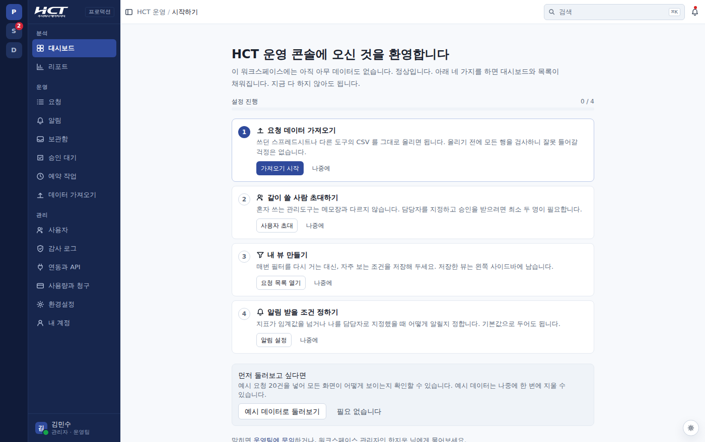

대부분의 제품이 여기서 실패합니다. 대시보드는 공들여 만들고, 첫 화면은 텅 빈
표로 둡니다. 사용자는 자기가 뭘 잘못했는지부터 의심하므로 **비어 있는 이유**를
먼저 말합니다. 할 일은 하나씩 주고, 건너뛸 수 있게 하고, 예시 데이터로 먼저
둘러볼 수 있게 합니다.

### 오류 — 셸 안과 밖을 구분합니다

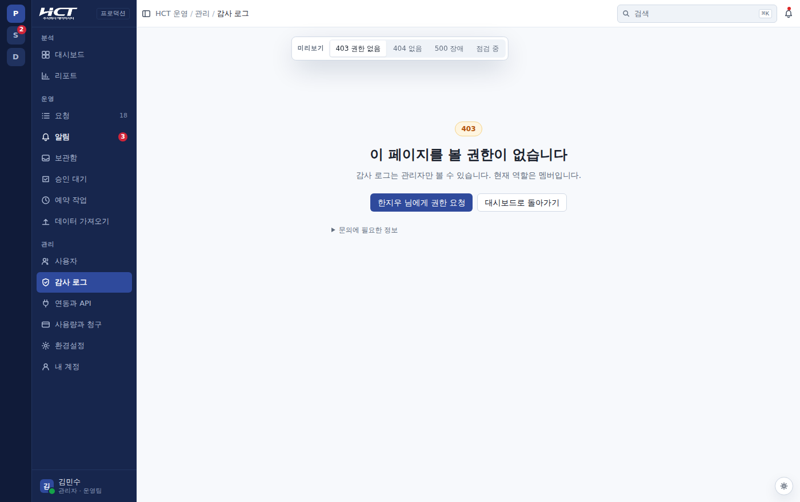

403·404 는 로그인은 되어 있고 앱 안에서 길을 잘못 든 것뿐이라 사이드바를
남깁니다. 셸을 지우면 쫓겨난 느낌이 들고 실제로 갈 곳도 없어집니다.
500·점검은 앱 자체가 응답하지 못하는 상태이므로 셸을 걷어냅니다 — 누를 수
있을 것처럼 보이는 메뉴가 전부 같은 오류로 떨어지는 것은 거짓 약속입니다.
403 은 "권한이 없습니다"로 끝내지 않고 **누구에게 요청하는지와 요청 버튼**까지
줍니다.

### 검색 — 왜 걸렸는지 보여줍니다

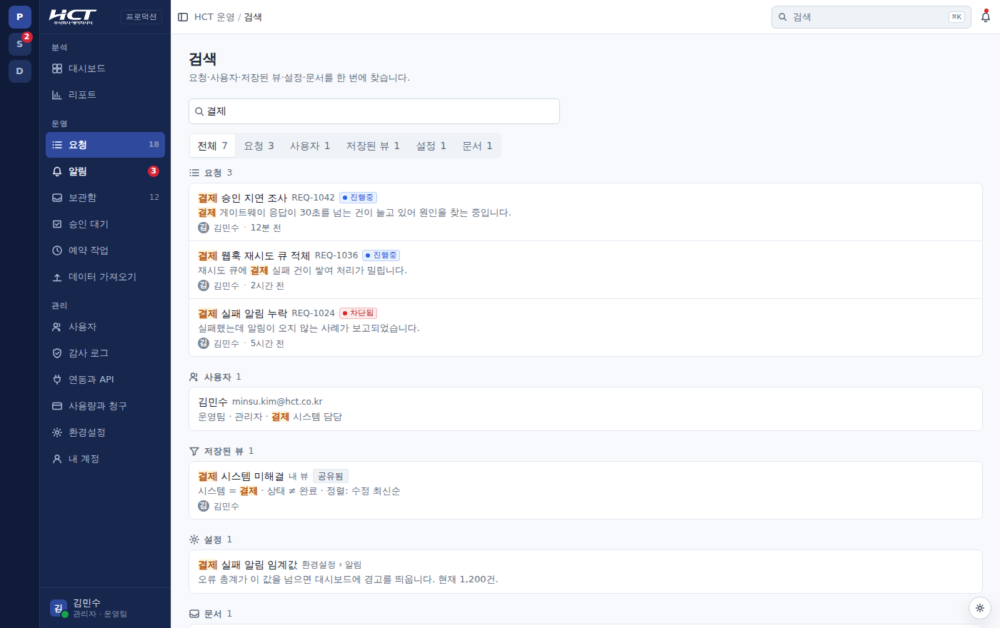

명령 팔레트(⌘K)가 아는 것을 빨리 여는 도구라면 이 화면은 모르는 것을 찾는
도구입니다. 종류가 섞이면 눈이 갈피를 못 잡으므로 묶어서 보여주고, 제목에
없는 말로 걸린 결과는 본문 안에서 일치 부분을 강조합니다. 못 찾았을 때는
오타·범위·권한 중 무엇이 문제인지 짚어줍니다.

### 로그인

| | |
|---|---|
| 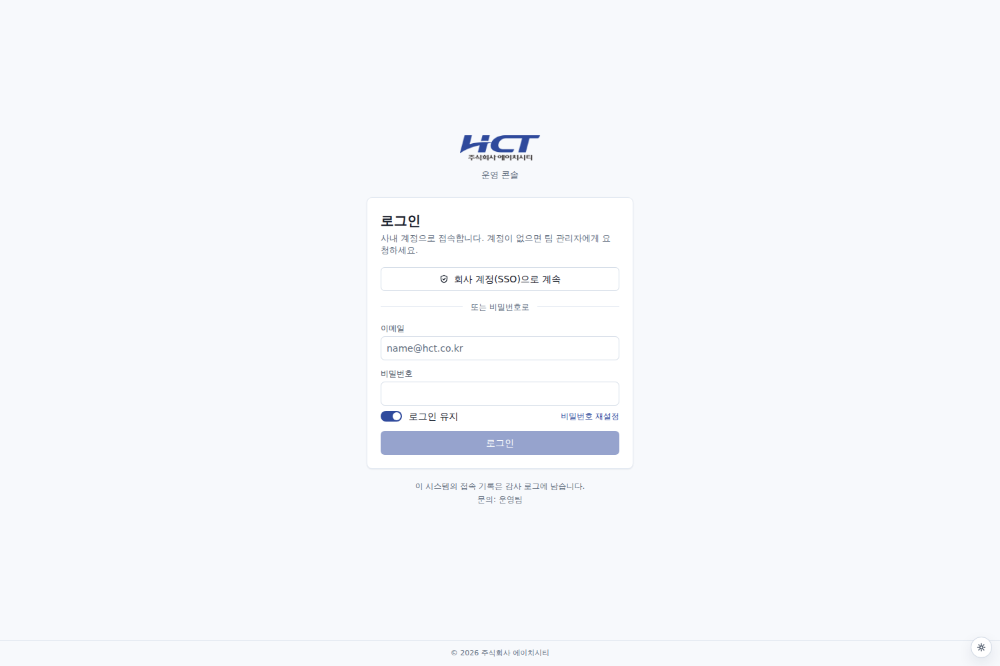 | 사내 도구의 로그인은 가입 유도가 없고 SSO 가 주 경로입니다. 실패는 **재시도로 풀리는 것**과 **잠김처럼 풀리지 않는 것**을 구분합니다 — "로그인 실패"만 반복하면 사용자는 열 번 더 틀리고 계정이 잠깁니다. 어느 쪽이 틀렸는지는 밝히지 않습니다(계정 존재 여부 노출). |

### 관리자

| 사용자 | 역할과 권한 |
|---|---|
| 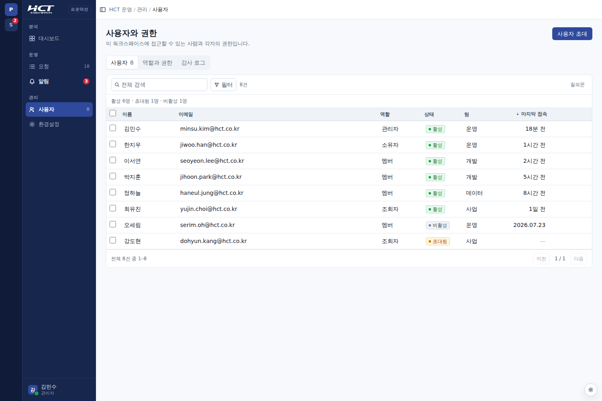 | 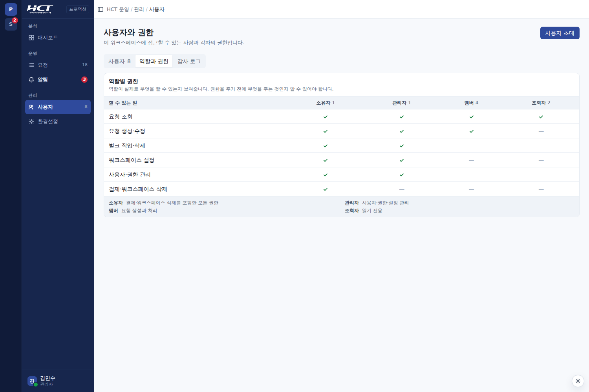 |

관리도구의 관리도구라 되돌릴 수 없는 일이 많습니다. **자기 권한을 스스로
내리거나 마지막 관리자를 없애는 것을 막습니다** — 둘 다 시스템을 관리 불가
상태로 만듭니다. 권한 매트릭스는 권한을 주기 전에 그게 무엇인지 보여줍니다.

### 설정 — 폼

섹션마다 저장 버튼을 두지 않고, 변경이 생기면 하단 저장 바가 뜹니다.
제출 실패 시 오류 요약에서 해당 필드로 이동합니다.


### 대용량 — 가상화와 부분 실패

5,000건 중 화면에 보이는 34행만 DOM 에 그립니다. 화면에 불러온 500건과
조건에 맞는 5,000건을 구분해, "전체 선택했다고 믿었는데 일부만 처리되는"
함정을 막습니다. 500건 중 75건이 실패하면 그 75건이 무엇인지 보여줍니다.


---

## 색 팔레트

| HCT (기본) | 그래파이트 |
|---|---|
| 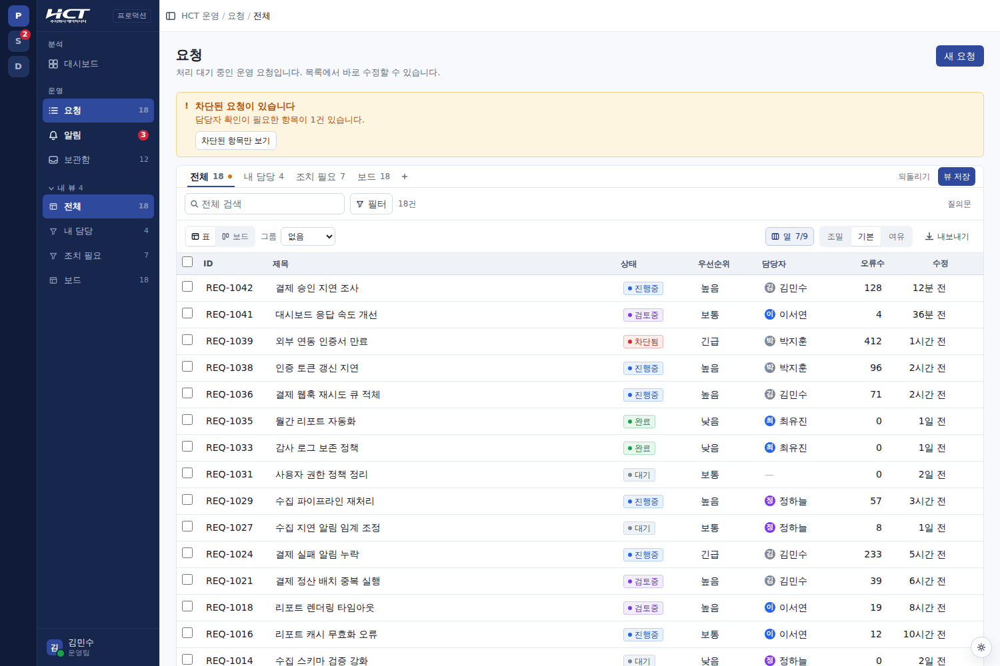 | 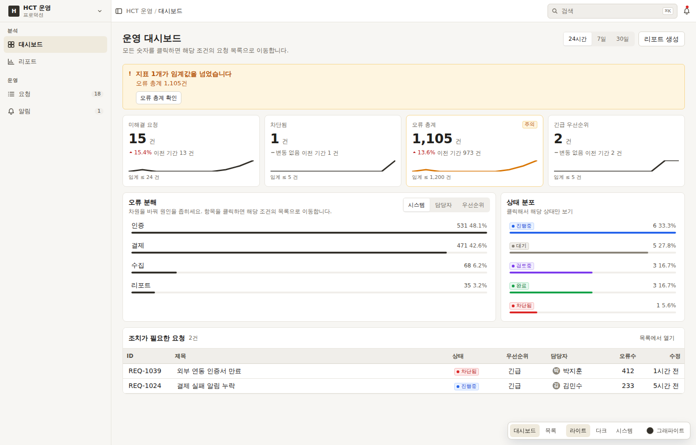 |

**네이비**는 탐색 영역과 작업 영역을 밝기로 가릅니다 — 사이드바가 짙은 남색,
콘텐츠는 흰색. **아크틱**은 같은 색 계열로 사이드바까지 밝게 갑니다.
사이드바가 전용 토큰군(`sidebar-*`)을 갖기 때문에 이 선택이 팔레트 단위로
가능합니다.

중성색에 자주·황토 기운이 없어 배경이 순수한 흰색(`#F7F9FC`)으로 읽힙니다.

| 플럼 | 그래파이트 다크 |
|---|---|
| 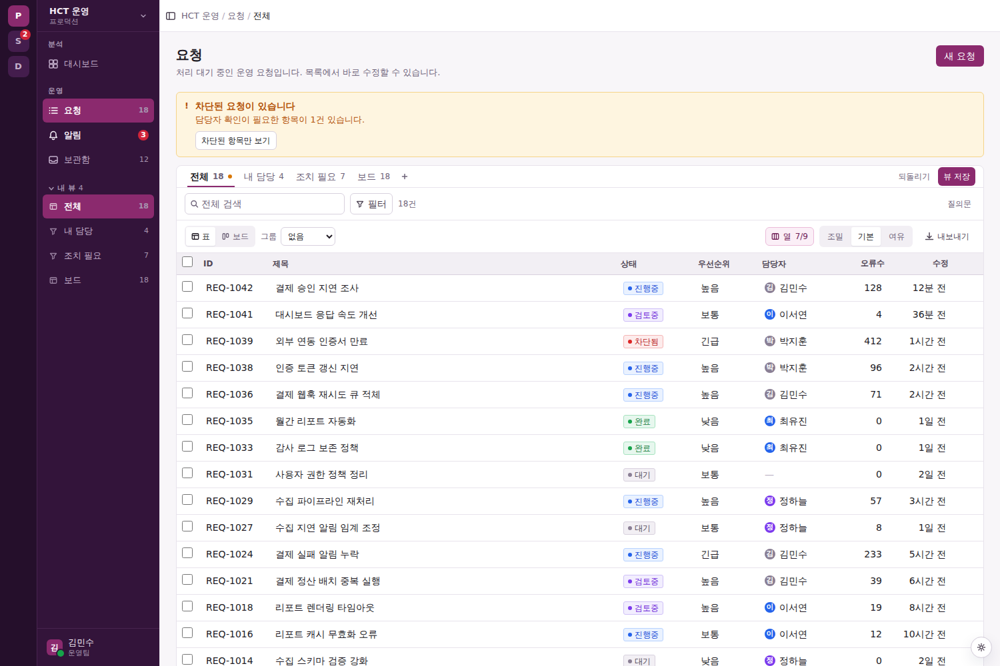 |  |


강조색과 중성색은 교체 가능한 **팔레트**입니다. 상태 색(성공·주의·위험·정보·검토)은
팔레트와 무관하게 고정입니다 — 의미를 나르는 색이라 제품 전체에서 같아야 합니다.

| id | 이름 | 성격 |
|---|---|---|
| `hct` | HCT | 로고색 강조 · 짙은 남색 사이드바 (**기본값**) |
| `navy` | 네이비 | 짙은 남색 사이드바 · 흰 콘텐츠 |
| `arctic` | 아크틱 | 전체 화이트 · 파랑 강조 |
| `graphite` | 그래파이트 | 무채색 강조 · 따뜻한 중성색 |
| `plum` | 플럼 | 어두운 자두색 사이드바 |
| `indigo` | 인디고 | 채도 낮춘 남보라 · 중립 회색 |

사이드바는 본문과 밝기가 다를 수 있어 `sidebar-*` 전용 토큰군을 갖습니다.
사이드바 안에서 `text-fg-primary` 같은 전역 토큰을 쓰면 어두운 사이드바에서
글자가 사라집니다.

```bash
# tokens/palettes.json 을 고친 뒤
npm run tokens:build
```

생성기가 라이트/다크 블록을 같은 데이터에서 뽑아내고, **WCAG 대비 검사**를
수행합니다. 본문·보조 텍스트·버튼 글자가 기준에 못 미치면 빌드가 실패합니다.

```
✓ 플럼          최저 여유: 다크 3차/표면 4.54:1 (기준 4.5)
✓ 그래파이트     최저 여유: 다크 3차/표면 4.55:1 (기준 4.5)
✓ 딥블루         최저 여유: 다크 3차/표면 5.05:1 (기준 4.5)
✓ 인디고         최저 여유: 다크 3차/표면 4.67:1 (기준 4.5)
```

HCT 브랜드 색이 확정되면 `tokens/palettes.json` 에 팔레트를 하나 추가하고
`DEFAULT_PALETTE` 를 바꾸면 됩니다.

---

## 문서

- [AGENTS.md](./AGENTS.md) — 에이전트 작업 규칙 (필독)
- [docs/layout.md](./docs/layout.md) — 앱 셸 구조와 화면 원형
- [docs/density.md](./docs/density.md) — 밀도·타이포·간격 규격
- [docs/status-colors.md](./docs/status-colors.md) — 상태 색상 체계
