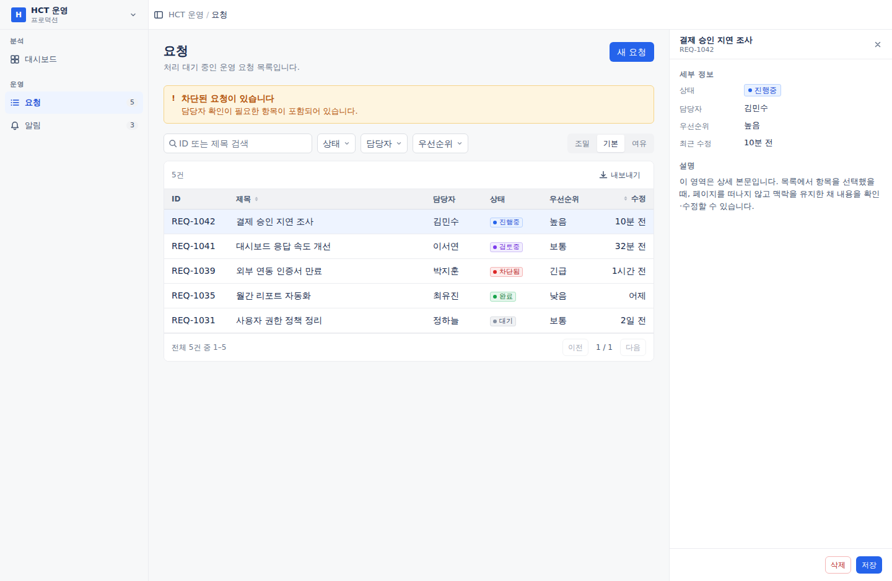
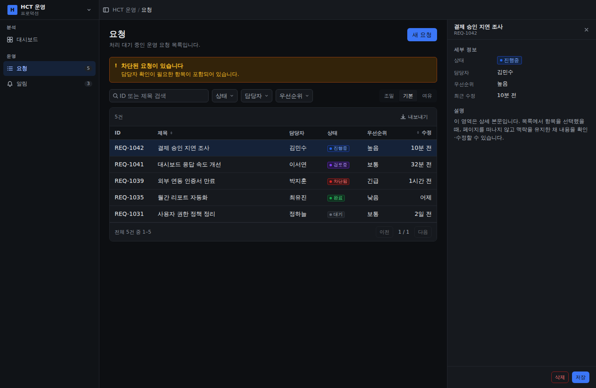
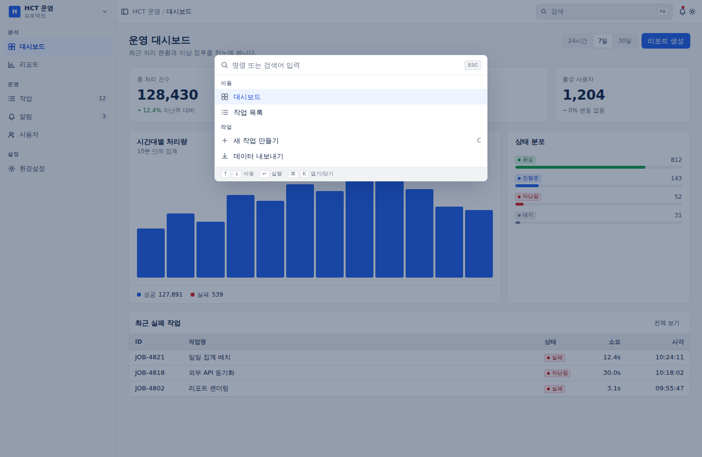

# HCT 웹 디자인 템플릿

대시보드 · 분석도구 · 관리도구를 만들 때 쓰는 디자인 시스템입니다.
여러 개발 에이전트가 각자 만든 화면이 **하나의 제품처럼 보이게** 하는 것이 목적입니다.

> **에이전트라면 [AGENTS.md](./AGENTS.md) 를 먼저 읽으세요.** 이 README 는 사람용 개요입니다.

---

## 무엇을 벤치마킹했나

노션 · 지라 · 슬랙은 겉모습이 달라 보이지만 골격이 같습니다. **웹페이지가 아니라 앱 셸**입니다.

```
┌────────┬──────────────────────────────┬─────────┐
│        │  상단바 (브레드크럼 / 검색)     │         │
│ 사이드바 ├──────────────────────────────┤ 우측     │
│        │                              │ 패널     │
│ (탐색)  │       메인 콘텐츠 영역          │ (상세)   │
│        │                              │         │
└────────┴──────────────────────────────┴─────────┘
                + 커맨드 팔레트 (⌘K)
```

이 저장소는 그 골격과, 그 안에 들어가는 블록들을 규격화한 것입니다.

**시각 방향은 지라형 고밀도**입니다. 본문 14px, 행 높이 32~40px, 명확한 구분선,
상태별 색상 코드. 관리도구는 한 화면에 정보가 많이 들어가야 하기 때문입니다.

---

## 통일성이 실제로 강제되는 방식

문서에 "규칙을 지켜주세요"라고 적으면 지켜지지 않습니다. 그래서 세 층으로 만들었습니다.

**1층 — 토큰이 선택지를 없앤다**
`tailwind.config.js` 에서 Tailwind 기본 색상 팔레트를 **삭제했습니다.**
`bg-blue-500` 은 존재하지 않는 클래스라 아무 효과가 없습니다. 간격도 4px 배수로 제한됩니다.
쓸 수 있는 값이 애초에 규격 안에만 있습니다.

**2층 — 컴포넌트가 결정을 대신한다**
`<StatusBadge status="inProgress" />` 는 색을 고를 권한을 주지 않습니다.
"진행중"은 어느 화면에서든 같은 파란색입니다.

**3층 — 검사가 위반을 잡는다**
```bash
npm run lint:design
```
생색 하드코딩, `dark:` 직접 사용, 스케일 밖 간격, 포커스 표시 제거, `<table>` 직접 작성,
`aria-label` 없는 아이콘 버튼 등 10개 규칙을 검사하고 위반 시 종료 코드 1을 냅니다.

---

## 저장소 구조

```
AGENTS.md              ← 에이전트 작업 규칙 (가장 중요)
CLAUDE.md              ← AGENTS.md 로 연결

tokens/tokens.json     ← 원천 토큰 (기계 판독용)
src/styles/tokens.css  ← CSS 변수 (라이트/다크)
tailwind.config.js     ← 토큰 → Tailwind 매핑

src/components/
  shell/     AppShell, Sidebar, Topbar, RightPanel
  data/      DataTable, StatCard, ChartFrame
  state/     EmptyState, NoResults, ErrorState, Skeleton
  input/     Button, TextField, FilterBar, SegmentedControl
  feedback/  StatusBadge, Tag, Banner
  overlay/   Modal, ConfirmDialog, Drawer, CommandPalette
  index.js   ← 여기서만 import

src/pages/
  DashboardPage.jsx    ← 대시보드 원형 (복사해서 시작)
  ListPage.jsx         ← 목록+상세 원형 (복사해서 시작)

scripts/lint-design.mjs
docs/
```

---

## 빠른 시작

```bash
npm install
npm run dev          # 미리보기 — 두 화면 원형과 라이트/다크 전환
npm run lint:design  # 디자인 규칙 검사
```

미리보기 우하단 컨트롤로 페이지와 테마를 바꿔볼 수 있습니다.

화면 하나 만들기:

```jsx
import { AppShell, PageContainer, PageHeader, DataTable, TableCard } from '@/components'
import './styles/index.css'
```

`src/pages/ListPage.jsx` 를 복사해서 시작하는 것이 가장 빠릅니다.

---

## 화면 원형

### 대시보드

KPI → 차트 → 최근 항목 테이블. 대시보드는 "보기만 하는 화면"이 되면 안 되고,
마지막에 항상 행동으로 이어지는 목록을 둡니다.

| 라이트 | 다크 |
|---|---|
|  |  |

### 목록 + 상세 패널

관리도구에서 가장 흔한 화면입니다. 행을 클릭하면 우측 패널이 열려
목록의 스크롤 위치와 필터 맥락을 잃지 않습니다.

| 라이트 | 다크 |
|---|---|
|  |  |

### 커맨드 팔레트 (⌘K)

노션·지라·슬랙이 모두 갖고 있는 기능입니다. 화면이 늘어나도 탐색 비용이 늘지 않습니다.
**새 화면을 추가하면 사이드바뿐 아니라 팔레트에도 등록하세요.**



---

## 다크 모드

시맨틱 토큰이 두 모드를 모두 정의하므로 **개발자가 신경 쓸 것이 없습니다.**
`dark:` 변형을 직접 쓰면 검사에서 실패합니다.

테마 상태는 세 가지입니다:

```js
import { applyTheme } from '@/components'

applyTheme('light')   // 시스템이 다크여도 라이트 고정
applyTheme('dark')
applyTheme('system')  // prefers-color-scheme 를 따름 (기본값)
```

---

## 브랜드 색상 교체

현재는 중립적인 기본 팔레트입니다. HCT 브랜드 색상이 확정되면 **두 곳만** 고치면 됩니다:

1. `tokens/tokens.json` → `brand.accent` (50~900)
2. `src/styles/tokens.css` → `--hct-accent-*` (50~900)

시맨틱 레이어는 건드리지 않습니다. 그 위에서 자동으로 재계산됩니다.

---

## 문서

- [AGENTS.md](./AGENTS.md) — 에이전트 작업 규칙 (필독)
- [docs/layout.md](./docs/layout.md) — 앱 셸 구조와 화면 원형
- [docs/density.md](./docs/density.md) — 밀도·타이포·간격 규격
- [docs/status-colors.md](./docs/status-colors.md) — 상태 색상 체계
