# HCT 웹 디자인 템플릿

대시보드 · 분석도구 · 관리도구를 만들 때 쓰는 디자인 시스템입니다.
여러 개발 에이전트가 각자 만든 화면이 **하나의 제품처럼 보이게** 하는 것이 목적입니다.

> **에이전트라면 [AGENTS.md](./AGENTS.md) 를 먼저 읽으세요.** 이 README 는 사람용 개요입니다.

---

## 벤치마킹한 것 — 레이아웃이 아니라 구조

노션·지라·슬랙의 공통점은 "사이드바가 있다"가 아닙니다.
셋 다 **하나의 원자(atom)와 그 위의 여러 투영(projection)** 구조입니다.

| | 원자 | 투영 |
|---|---|---|
| 노션 | 페이지/블록 | 표 · 보드 · 갤러리 · 캘린더 |
| 지라 | 이슈 | 백로그 · 보드 · 목록 · 대시보드 |
| 슬랙 | 메시지 | 채널 · 스레드 · 저장됨 · 멘션 |

그래서 이 시스템의 중심은 컴포넌트가 아니라 **필드 스키마**입니다.
스키마 하나를 정의하면 표·보드·상세·필터·질의·대시보드가 전부 거기서 나옵니다.

```
필드 스키마 (src/lib/fields.js)
   ├─ DataGrid      표 뷰 + 인라인 편집 + 그룹핑
   ├─ BoardView     보드 뷰 + 드래그로 상태 전환
   ├─ ObjectDetail  상세 + 활동 기록
   ├─ QueryBar      필터 빌더 + 질의문
   └─ MetricTile    지표 = 질의 + 집계 → 클릭하면 목록으로
```

**시각 방향은 지라형 고밀도**입니다. 본문 14px, 행 32~40px, 명확한 구분선,
상태별 색상 코드.

---

## 이 시스템이 실제로 하는 것

### 1. 같은 데이터, 여러 뷰

표에서 보던 레코드를 보드로 전환하면 같은 레코드가 컬럼으로 재배치됩니다.
카드를 끌어 옮기면 상태가 바뀌고, 표로 돌아가면 반영되어 있습니다.

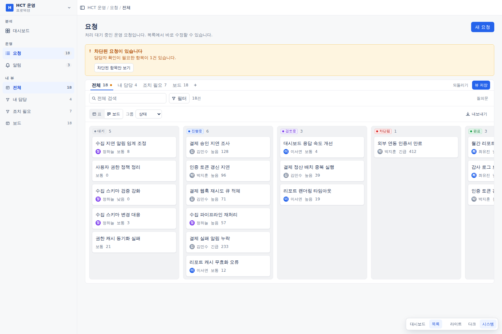

### 2. 저장된 뷰가 곧 내비게이션

사이드바의 "내 뷰"는 개발자가 하드코딩한 메뉴가 아니라 사용자가 저장한 질의입니다.
필터를 바꾸면 탭에 점이 뜨고, 저장하거나 되돌릴 수 있습니다.

### 3. 필터는 다룰 수 있는 객체

조건을 쌓고, 결합 방식(AND/OR)을 고르고, 질의문으로 읽고, 뷰로 저장합니다.

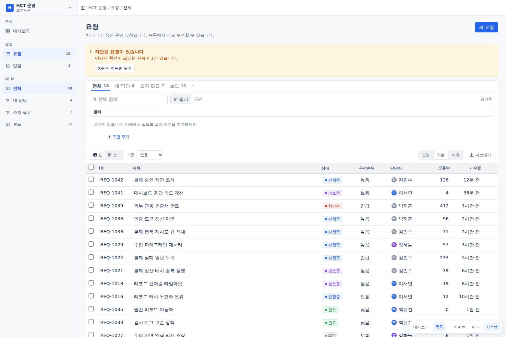

### 4. 목록에서 바로 끝냅니다

셀을 클릭하면 그 자리에서 편집됩니다. 상세 페이지로 갈 필요가 없습니다.
Shift 로 범위 선택하고 벌크 액션을 실행합니다. 행 액션은 호버 시에만 나타납니다.

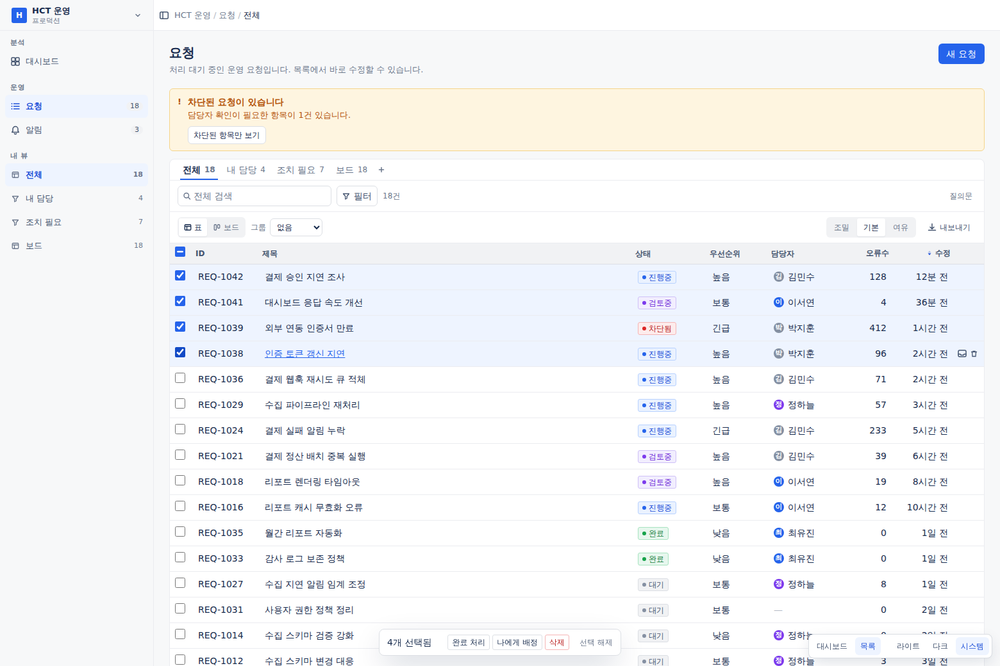

### 5. 상세는 살아있는 객체

읽기 전용 속성 나열이 아니라, 인라인 편집 + 상태 전환 + 변경 이력과 댓글이
한 줄기로 흐르는 활동 피드입니다.

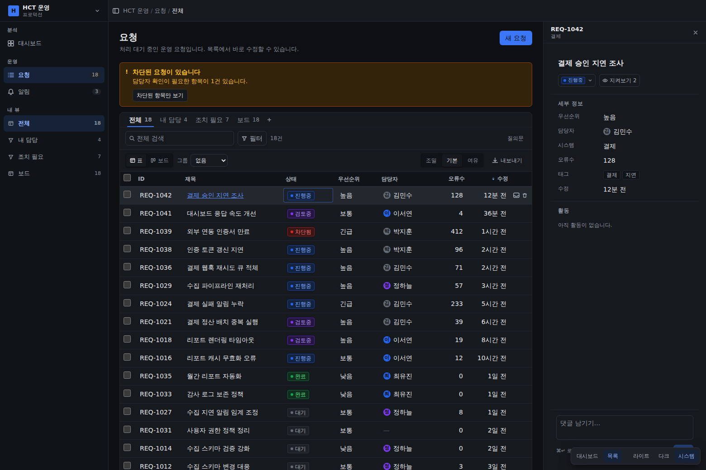

### 6. 대시보드는 작업의 입구

모든 지표가 **질의 + 집계**입니다. 숫자가 어떤 레코드에서 나왔는지 알고 있어서,
클릭하면 그 조건으로 필터된 목록에 그대로 들어갑니다.

| 대시보드 | 지표 클릭 → 드릴다운 |
|---|---|
| 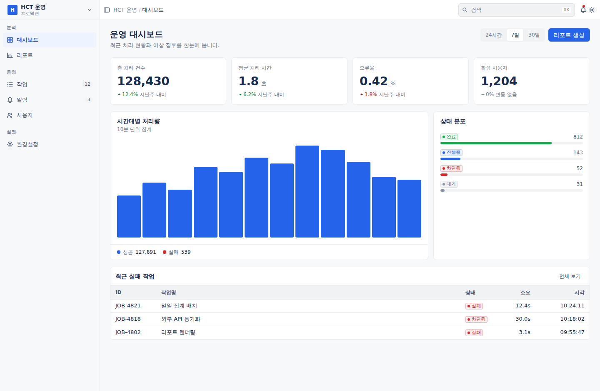 | 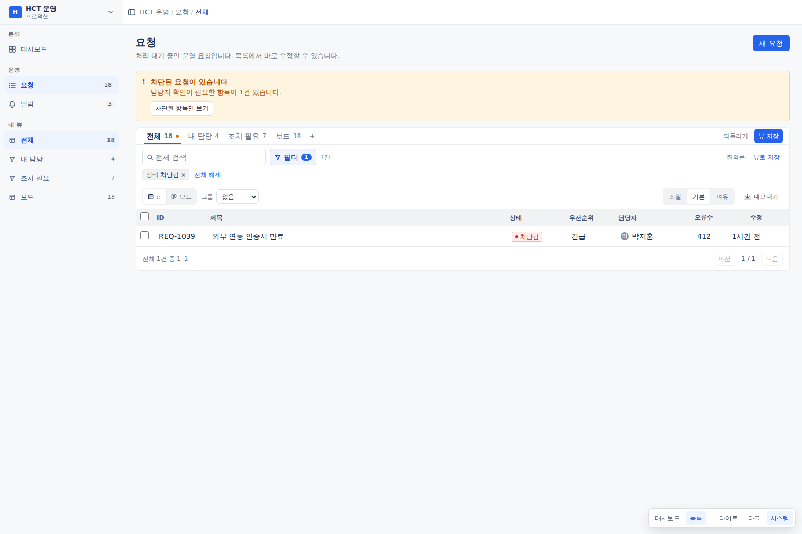 |

임계값을 넘긴 지표는 스스로 알리고, 증감은 **비교 대상 값을 함께** 밝힙니다.
분해(breakdown)는 지표와 같은 집계를 써서 합계와 조각이 일치합니다.

라이트/다크는 시맨틱 토큰이 모두 처리합니다.

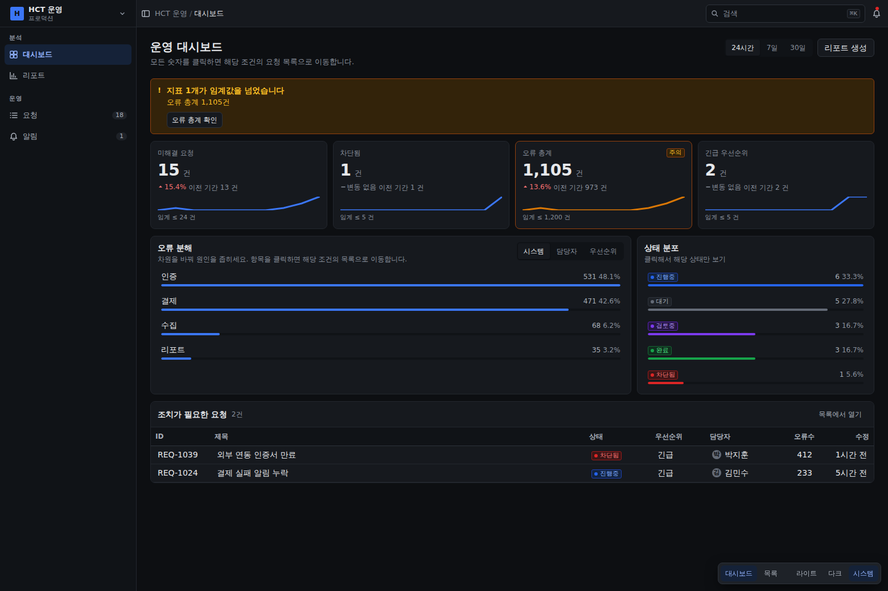

---

## 통일성이 강제되는 방식

문서에 "규칙을 지켜주세요"라고 적으면 지켜지지 않습니다. 세 층으로 만들었습니다.

**1층 — 토큰이 선택지를 없앰**
`tailwind.config.js` 에서 Tailwind 기본 색상 팔레트를 **삭제했습니다.**
`bg-blue-500` 은 존재하지 않는 클래스라 아무 효과가 없습니다.
간격도 4px 배수로 제한됩니다.

**2층 — 컴포넌트가 결정을 대신함**
`<StatusBadge status="inProgress" />` 는 색을 고를 권한을 주지 않습니다.
필드 스키마의 `status` 키가 색을 결정하므로, "진행중"은 표에서든 보드에서든
상세에서든 대시보드에서든 같은 파란색입니다.

**3층 — 검사가 위반을 잡음**
```bash
npm run lint:design
```
생색 하드코딩, `dark:` 직접 사용, 스케일 밖 간격, 포커스 표시 제거,
`<table>` 직접 작성 등 11개 규칙. 위반 시 종료 코드 1.

---

## 빠른 시작

```bash
npm install
npm run dev          # 미리보기 — 대시보드 지표를 클릭해 드릴다운을 확인하세요
npm run lint:design
```

새 화면은 `src/pages/ListPage.jsx` 를 복사해서 시작하세요. 백지에서 시작하지 마세요.

---

## 저장소 구조

```
AGENTS.md                에이전트 작업 규칙 (가장 중요)
CLAUDE.md                AGENTS.md 로 연결

src/lib/
  fields.js              필드 타입 시스템 — 이 시스템의 원자
  query.js               질의 모델 (필터·정렬·그룹핑)
  queryUrl.js            질의 ↔ URL 직렬화 (링크로 공유)
  metrics.js             지표 = 질의 + 집계, 드릴다운·분해·임계값
  useRecords.js          낙관적 편집 + 롤백 + 실행 취소 + 활동 기록
  useForm.js             폼 상태·검증·dirty 추적·이탈 방지
  useGridKeyboard.js     목록 키보드 조작
  useVirtualRows.js      행 가상화
  useBottomBar.js        하단 중앙 요소 충돌 방지
  useMeasuredWidth.js    SVG 차트 반응형 폭
  cn.js / theme.js

tokens/tokens.json       원천 토큰
src/styles/tokens.css    CSS 변수 (라이트/다크)
tailwind.config.js       토큰 → Tailwind 매핑

src/components/
  shell/     AppShell, Sidebar, Topbar, RightPanel
  grid/      DataGrid(가상화·키보드), GridCell, ColumnSettings, GridChrome
  view/      BoardView, ViewTabs, ViewSwitcher, SavedViewList
  query/     QueryBar, FilterBuilder
  object/    ObjectDetail, StatusTransition, ActivityFeed
  chart/     LineChart, BarChart, ChartTable, chartTokens
  dashboard/ MetricTile, BreakdownList, Sparkline, Widget
  form/      Form, FormSection, FormRow, SaveBar, Switch, RadioCards
  state/     EmptyState, NoResults, ErrorState, Skeleton
  input/     Button, TextField, Combobox, SegmentedControl
  feedback/  StatusBadge, Tag, Banner, Toast, Progress, JobStatus
  overlay/   Modal, ConfirmDialog, Drawer, CommandPalette, ShortcutHelp
  index.js   ← 여기서만 import

src/pages/
  DashboardPage.jsx      대시보드 원형 (드릴다운·차트)
  ListPage.jsx           목록+뷰+상세 원형
  SettingsPage.jsx       설정·폼 원형
  ScalePage.jsx          대용량·비동기 작업 원형
  _data.js               스키마와 예시 레코드

scripts/lint-design.mjs
docs/
```

---

## 화면 원형 4종

| | 무엇을 보여주는가 |
|---|---|
| **대시보드** | 지표 = 질의 + 집계. 클릭하면 목록으로 드릴다운. 선·막대 차트, 임계값 |
| **목록 + 상세** | 표↔보드 전환, 인라인 편집, 저장된 뷰, 키보드 조작, 실행 취소 |
| **설정** | 폼 검증, 오류 요약, 저장 바, 이탈 방지, Combobox |
| **대용량** | 5,000건 가상화, 조건 전체 선택, 진행률과 부분 실패 |

### 설정 — 폼

섹션마다 저장 버튼을 두지 않고, 변경이 생기면 하단 저장 바가 뜹니다.
제출 실패 시 오류 요약에서 해당 필드로 이동합니다.

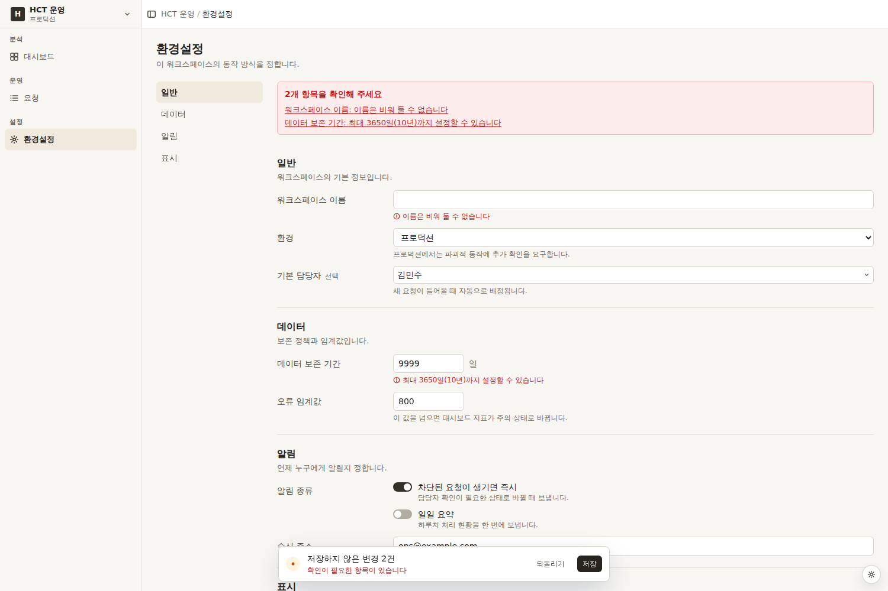

### 대용량 — 가상화와 부분 실패

5,000건 중 화면에 보이는 34행만 DOM 에 그립니다. 화면에 불러온 500건과
조건에 맞는 5,000건을 구분해, "전체 선택했다고 믿었는데 일부만 처리되는"
함정을 막습니다. 500건 중 75건이 실패하면 그 75건이 무엇인지 보여줍니다.

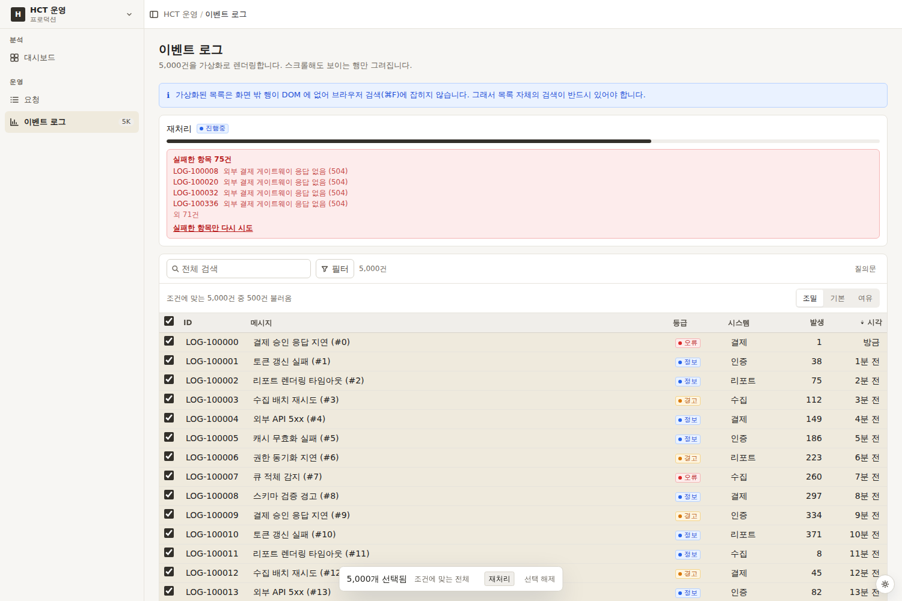

---

## 색 팔레트

| 네이비 (기본) | 아크틱 |
|---|---|
| 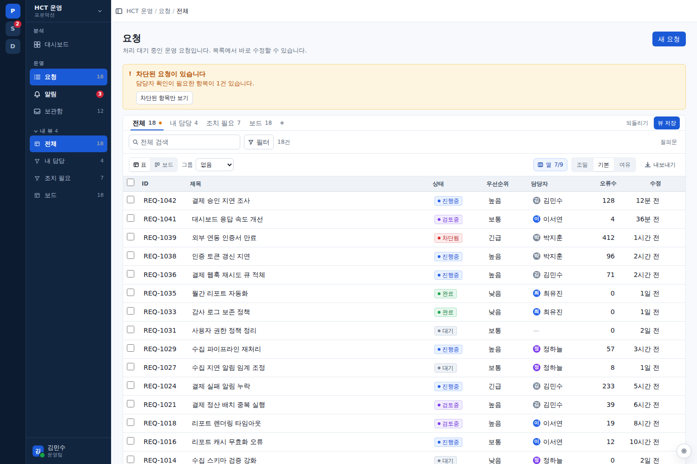 | 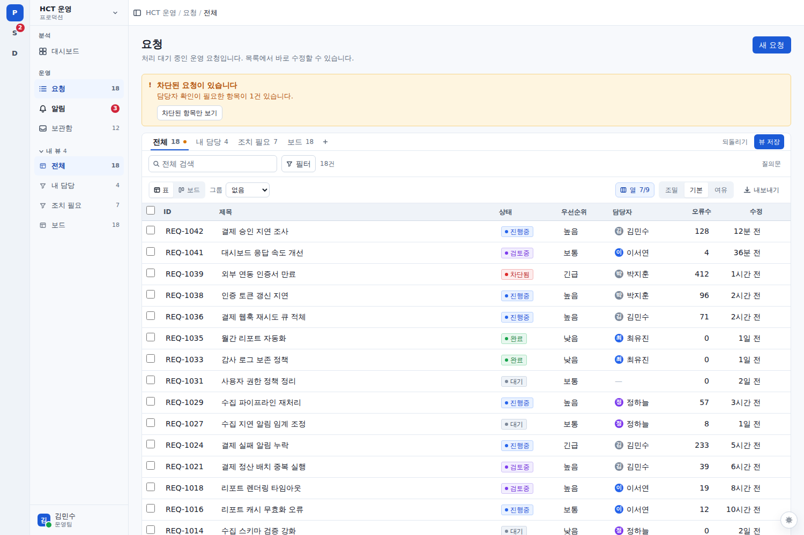 |

**네이비**는 탐색 영역과 작업 영역을 밝기로 가릅니다 — 사이드바가 짙은 남색,
콘텐츠는 흰색. **아크틱**은 같은 색 계열로 사이드바까지 밝게 갑니다.
사이드바가 전용 토큰군(`sidebar-*`)을 갖기 때문에 이 선택이 팔레트 단위로
가능합니다.

중성색에 자주·황토 기운이 없어 배경이 순수한 흰색(`#F7F9FC`)으로 읽힙니다.

| 네이비 다크 | 그래파이트 다크 |
|---|---|
| 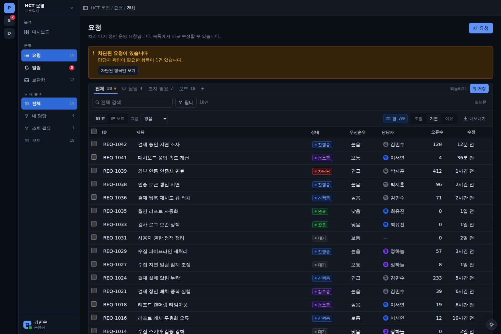 | 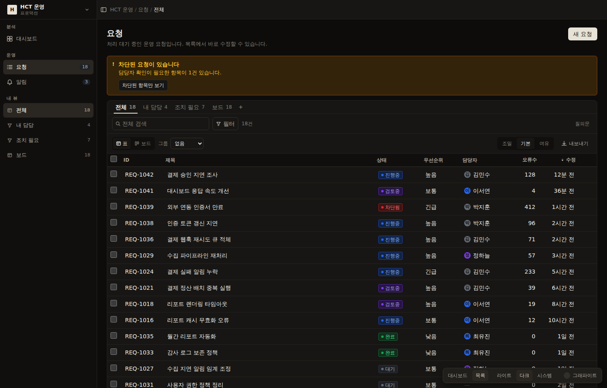 |


강조색과 중성색은 교체 가능한 **팔레트**입니다. 상태 색(성공·주의·위험·정보·검토)은
팔레트와 무관하게 고정입니다 — 의미를 나르는 색이라 제품 전체에서 같아야 합니다.

| id | 이름 | 성격 |
|---|---|---|
| `navy` | 네이비 | 짙은 남색 사이드바 · 흰 콘텐츠 (**기본값**) |
| `arctic` | 아크틱 | 전체 화이트 · 파랑 강조 |
| `graphite` | 그래파이트 | 무채색 강조 · 따뜻한 중성색 |
| `plum` | 플럼 | 어두운 자두색 사이드바 |
| `indigo` | 인디고 | 채도 낮춘 남보라 · 중립 회색 |

사이드바는 본문과 밝기가 다를 수 있어 `sidebar-*` 전용 토큰군을 갖습니다.
사이드바 안에서 `text-fg-primary` 같은 전역 토큰을 쓰면 어두운 사이드바에서
글자가 사라집니다.

```bash
# tokens/palettes.json 을 고친 뒤
npm run tokens:build
```

생성기가 라이트/다크 블록을 같은 데이터에서 뽑아내고, **WCAG 대비 검사**를
수행합니다. 본문·보조 텍스트·버튼 글자가 기준에 못 미치면 빌드가 실패합니다.

```
✓ 플럼          최저 여유: 다크 3차/표면 4.54:1 (기준 4.5)
✓ 그래파이트     최저 여유: 다크 3차/표면 4.55:1 (기준 4.5)
✓ 딥블루         최저 여유: 다크 3차/표면 5.05:1 (기준 4.5)
✓ 인디고         최저 여유: 다크 3차/표면 4.67:1 (기준 4.5)
```

HCT 브랜드 색이 확정되면 `tokens/palettes.json` 에 팔레트를 하나 추가하고
`DEFAULT_PALETTE` 를 바꾸면 됩니다.

---

## 문서

- [AGENTS.md](./AGENTS.md) — 에이전트 작업 규칙 (필독)
- [docs/layout.md](./docs/layout.md) — 앱 셸 구조와 화면 원형
- [docs/density.md](./docs/density.md) — 밀도·타이포·간격 규격
- [docs/status-colors.md](./docs/status-colors.md) — 상태 색상 체계
